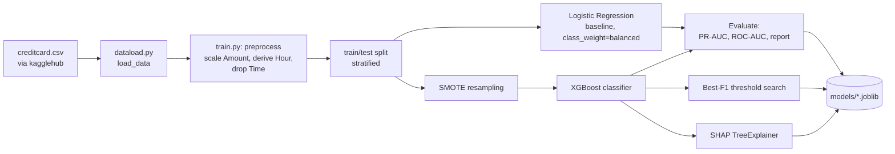
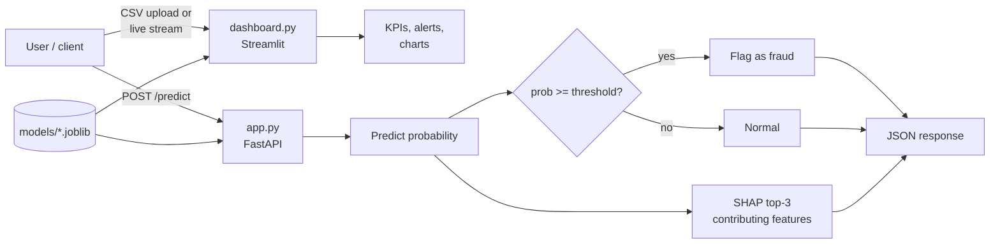

# Credit Card Fraud Detection

An end-to-end fraud detection pipeline on the [Kaggle mlg-ulb/creditcardfraud dataset](https://www.kaggle.com/datasets/mlg-ulb/creditcardfraud), covering model training, explainability, a live-monitoring dashboard, and a serving API.

## Overview

- **Model**: XGBoost classifier trained on SMOTE-resampled data, benchmarked against a class-weighted Logistic Regression baseline.
- **Explainability**: SHAP TreeExplainer for per-transaction feature attribution.
- **Dashboard**: Streamlit app with a live transaction-stream simulation (real-time KPIs, fraud alerts) and a batch CSV scoring tab.
- **API**: FastAPI service exposing a `/predict` endpoint that returns fraud probability plus the top-3 contributing features per transaction.

## Training pipeline



## Serving pipeline



## Project structure
credit_card_fraud/
├── dataload.py      # Loads creditcard.csv from a kagglehub download path
├── train.py         # Trains LR baseline + SMOTE/XGBoost model, saves artifacts
├── dashboard.py      # Streamlit dashboard (live stream + batch scoring)
├── app.py            # FastAPI serving endpoint
├── models/            # Saved model artifacts (gitignored — regenerate locally)
├── requirements.txt
└── README.md
## Setup

```bash
git clone https://github.com/rohanyadav2005/Credit_card_fraud_detection.git
cd Credit_card_fraud_detection
python -m venv venv
source venv/bin/activate   # venv\Scripts\activate on Windows
pip install -r requirements.txt
```

## Getting the data

```python
import kagglehub
path = kagglehub.dataset_download("mlg-ulb/creditcardfraud")
print(path)
```

## Usage

**1. Train the model**

```bash
python train.py --data_path <kagglehub_path>
```

This saves `models/xgb_model.joblib`, `scaler.joblib`, `shap_explainer.joblib`, `best_threshold.joblib`, and `feature_columns.joblib`, and prints PR-AUC / ROC-AUC / classification report for both the LR baseline and XGBoost.

**2. Run the dashboard**

```bash
streamlit run dashboard.py
```

Stream simulated transactions with live fraud alerts, or upload a CSV for batch scoring.

**3. Run the API**

```bash
uvicorn app:app --reload
```

- `GET /` — health check
- `GET /schema` — required feature columns + decision threshold
- `POST /predict` — send a transaction's feature values, get back fraud probability, a flag, and the top-3 SHAP-contributing features

## Notes

- `Time` is dropped in favor of a derived `Hour` (cyclical hour-of-day) feature; `Amount` is standardized.
- The decision threshold is chosen post-hoc to maximize F1 score on the held-out test set rather than using the default 0.5.
- `V1`–`V28` are the dataset's pre-anonymized PCA components.
